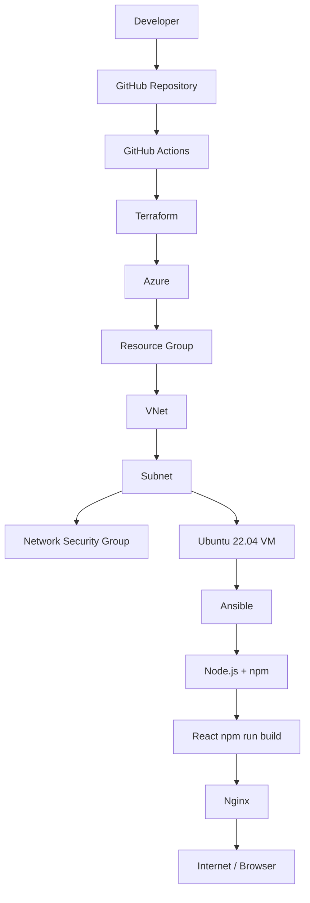

# Azure React CI/CD Platform — Terraform + Ansible + GitHub Actions

## 1. Présentation du projet

Ce dépôt fournit une plateforme CI/CD de référence pour déployer automatiquement une application React sur une VM Linux Microsoft Azure.

Le pipeline suit le flux :

**Git push → GitHub Actions → Terraform → Azure VM → Ansible → Node.js/npm → React build → Nginx → HTTP**

À chaque push sur `main`, GitHub Actions :

1. s'authentifie sur Azure ;
2. initialise Terraform ;
3. valide et planifie l'infrastructure ;
4. applique l'infrastructure ;
5. récupère l'IP publique de la VM ;
6. installe Ansible ;
7. génère l'inventaire ;
8. configure la VM ;
9. clone le commit déployé ;
10. construit React ;
11. publie `dist/` dans Nginx ;
12. vérifie `/health`.

> **Note de version** : le projet est figé sur Terraform 1.15.9 et AzureRM 5.0.1 au 26/08/2026. Vérifiez les versions disponibles avant une mise à jour de production.

## 2. Architecture

### Ressources Azure

- Resource Group
- Virtual Network `10.20.0.0/16`
- Subnet `10.20.1.0/24`
- Network Security Group
- Public IP Standard Static
- Network Interface
- Ubuntu Server 22.04 LTS Gen2
- Nginx
- Node.js LTS / npm

### Diagramme



## 3. Arborescence

```text
.
├── .github/
│   └── workflows/
│       └── deploy.yml
├── ansible/
│   ├── inventory.tpl
│   ├── playbook.yml
│   └── roles/
│       └── react/
│           ├── handlers/main.yml
│           ├── tasks/main.yml
│           ├── templates/nginx.conf.j2
│           └── vars/main.yml
├── app/
│   ├── index.html
│   ├── package.json
│   ├── vite.config.js
│   └── src/
│       ├── main.jsx
│       └── style.css
├── terraform/
│   ├── main.tf
│   ├── network.tf
│   ├── outputs.tf
│   ├── provider.tf
│   ├── security.tf
│   ├── terraform.tfvars.example
│   ├── variables.tf
│   ├── versions.tf
│   └── vm.tf
├── .gitignore
└── README.md
```

## 4. Prérequis

Installer localement :

- Azure CLI
- Terraform 1.15.9
- Ansible
- Git
- OpenSSH client
- Node.js LTS et npm pour tester l'application localement

Authentification locale :

```bash
az login
az account set --subscription "<SUBSCRIPTION_ID>"
az account show
```

## 5. Création du Service Principal Azure

Pour le laboratoire, un Service Principal avec `Contributor` peut être utilisé. En entreprise, préférez OIDC / Workload Identity Federation et le moindre privilège.

```bash
az login

SUBSCRIPTION_ID="$(az account show --query id -o tsv)"

az ad sp create-for-rbac \
  --name "sp-reactcicd-github" \
  --role Contributor \
  --scopes "/subscriptions/${SUBSCRIPTION_ID}"
```

La commande retourne notamment `appId`, `password` et `tenant`. Conservez le secret immédiatement : Azure ne permet pas de récupérer ultérieurement le même mot de passe.

Vérifier :

```bash
az role assignment list \
  --assignee "<AZURE_CLIENT_ID>" \
  --scope "/subscriptions/${SUBSCRIPTION_ID}" \
  -o table
```

## 6. Configuration GitHub Secrets

Dans GitHub :

**Repository → Settings → Secrets and variables → Actions → New repository secret**

Créer :

| Secret | Contenu |
|---|---|
| `AZURE_CLIENT_ID` | `appId` du Service Principal |
| `AZURE_CLIENT_SECRET` | `password` du Service Principal |
| `AZURE_SUBSCRIPTION_ID` | ID de souscription Azure |
| `AZURE_TENANT_ID` | ID du tenant Microsoft Entra |
| `SSH_PRIVATE_KEY` | clé privée OpenSSH complète |
| `SSH_PUBLIC_KEY` | clé publique OpenSSH complète |

Créez également un **Environment GitHub `production`** et rattachez le job à cet environnement. Il est recommandé d'ajouter une approbation manuelle pour une vraie production.

## 7. Génération des clés SSH

Linux/macOS :

```bash
mkdir -p ~/.ssh
chmod 700 ~/.ssh

ssh-keygen -t ed25519 \
  -C "github-actions-reactcicd" \
  -f ~/.ssh/reactcicd_ed25519
```

Windows PowerShell :

```powershell
ssh-keygen -t ed25519 -C "github-actions-reactcicd" -f "$env:USERPROFILE\.ssh\reactcicd_ed25519"
```

Vérifier :

```bash
ssh-keygen -y -f ~/.ssh/reactcicd_ed25519
cat ~/.ssh/reactcicd_ed25519.pub
```

Copiez :

- contenu de `reactcicd_ed25519` → `SSH_PRIVATE_KEY`
- contenu de `reactcicd_ed25519.pub` → `SSH_PUBLIC_KEY`

**Ne committez jamais la clé privée.**

## 8. Application React

Le dossier `app/` contient une application React/Vite de démonstration.

Pour tester :

```bash
cd app
npm install
npm run build
```

Le build est créé dans `app/dist/`.

## 9. Installation locale

Cloner :

```bash
git clone https://github.com/<ORG>/<REPO>.git
cd <REPO>
```

Préparer Terraform :

```bash
cp terraform/terraform.tfvars.example terraform/terraform.tfvars
```

Renseigner `ssh_public_key` et éventuellement `allowed_ssh_cidr`.

## 10. Initialisation Terraform

```bash
cd terraform
terraform init
terraform fmt -recursive
terraform validate
```

Contrôler :

```bash
terraform providers
terraform version
```

## 11. Déploiement Terraform

Plan :

```bash
terraform plan
```

Application :

```bash
terraform apply
```

Récupérer l'IP :

```bash
terraform output -raw vm_public_ip
```

Récupérer l'URL :

```bash
terraform output -raw application_url
```

## 12. Exécution Ansible

Installer Ansible :

```bash
python3 -m pip install --upgrade pip
python3 -m pip install ansible
sudo apt-get install -y rsync
```

Créer manuellement l'inventaire :

```ini
[web]
<PUBLIC_IP> ansible_user=azureadmin ansible_ssh_private_key_file=~/.ssh/reactcicd_ed25519 ansible_python_interpreter=/usr/bin/python3

[web:vars]
ansible_ssh_common_args='-o StrictHostKeyChecking=no -o UserKnownHostsFile=/dev/null'
```

Tester SSH :

```bash
ssh -i ~/.ssh/reactcicd_ed25519 azureadmin@<PUBLIC_IP>
```

Tester Ansible :

```bash
ansible -i ansible/inventory.ini web -m ping
```

Déployer :

```bash
REPO_URL="https://github.com/<ORG>/<REPO>.git"

ansible-playbook \
  -i ansible/inventory.ini \
  ansible/playbook.yml \
  -e "repo_url=${REPO_URL}" \
  -e "repo_version=main"
```

## 13. Pipeline GitHub Actions

Le workflow `.github/workflows/deploy.yml` est déclenché par :

```yaml
on:
  push:
    branches:
      - main
```

Il peut également être lancé manuellement avec `workflow_dispatch`.

Étapes principales :

1. checkout ;
2. Azure Login ;
3. setup Terraform ;
4. `terraform init` ;
5. `terraform fmt -check` ;
6. `terraform validate` ;
7. `terraform plan` ;
8. `terraform apply` ;
9. récupération de `vm_public_ip` ;
10. installation Ansible ;
11. création de la clé SSH ;
12. génération de l'inventory ;
13. attente SSH ;
14. `ansible-playbook` ;
15. `curl http://IP/health`.

Le workflow utilise `terraform apply` sur le plan généré dans le même job afin de limiter l'écart entre plan et apply.

## 14. Vérification du déploiement

Après le pipeline :

```bash
curl http://<PUBLIC_IP>/health
```

Résultat attendu :

```text
ok
```

Puis :

```text
http://<PUBLIC_IP>
```

Vérifications serveur :

```bash
systemctl status nginx
nginx -t
node --version
npm --version
ls -la /var/www/react-app
tail -f /var/log/nginx/react-app.access.log
tail -f /var/log/nginx/react-app.error.log
```

## 15. Procédure de destruction

**Attention : cette commande supprime l'infrastructure gérée par ce state.**

```bash
cd terraform
terraform destroy
```

Puis confirmer.

## 16. Dépannage — Terraform

### `Error acquiring the state lock`

Avec un backend local sur un runner éphémère, ce problème est généralement lié à des exécutions concurrentes ou à un état mal partagé.

Ce projet utilise une concurrence GitHub Actions pour éviter deux déploiements simultanés :

```yaml
concurrency:
  group: production-deployment
  cancel-in-progress: false
```

Pour une vraie équipe, migrez le state vers Azure Storage avec verrouillage blob et séparez le bootstrap du backend.

### Provider non disponible

```bash
rm -rf .terraform
terraform init -upgrade
```

### Erreur de version

Vérifier :

```bash
terraform version
```

puis respecter la contrainte de `versions.tf`.

## 17. Dépannage — Azure

### `AuthorizationFailed`

Le Service Principal n'a pas le rôle requis au scope ciblé.

```bash
az role assignment list \
  --assignee "<CLIENT_ID>" \
  --all \
  -o table
```

Pour un laboratoire :

```bash
az role assignment create \
  --assignee "<CLIENT_ID>" \
  --role Contributor \
  --scope "/subscriptions/<SUBSCRIPTION_ID>"
```

Réduisez ensuite le scope au Resource Group lorsque c'est possible.

### Quota VM

Si `Standard_B2s` n'est pas disponible dans la région, choisir une autre taille ou région.

## 18. Dépannage — SSH

### `Permission denied (publickey)`

Vérifier que la clé privée correspond à la clé publique :

```bash
ssh-keygen -y -f ~/.ssh/reactcicd_ed25519
```

Comparer avec :

```bash
cat ~/.ssh/reactcicd_ed25519.pub
```

Vérifier les permissions :

```bash
chmod 600 ~/.ssh/reactcicd_ed25519
```

### `error in libcrypto`

Cela indique souvent un format de clé invalide, une clé avec des retours à la ligne incorrects ou un fichier qui n'est pas une vraie clé privée OpenSSH.

Tester localement :

```bash
ssh-keygen -y -f ~/.ssh/reactcicd_ed25519
```

Cette commande doit fonctionner avant de copier la clé dans GitHub Secrets.

## 19. Dépannage — Ansible

Tester la connectivité :

```bash
ansible -i ansible/inventory.ini web -m ping -vvv
```

Afficher les variables :

```bash
ansible-inventory -i ansible/inventory.ini --graph
```

Exécuter le playbook avec davantage de logs :

```bash
ansible-playbook \
  -i ansible/inventory.ini \
  ansible/playbook.yml \
  -e "repo_url=https://github.com/<ORG>/<REPO>.git" \
  -vvv
```

## 20. Dépannage — Nginx

Tester :

```bash
sudo nginx -t
sudo systemctl status nginx
```

Vérifier le site :

```bash
ls -la /etc/nginx/sites-enabled/
ls -la /var/www/react-app/
```

Vérifier les logs :

```bash
sudo tail -100 /var/log/nginx/react-app.error.log
sudo tail -100 /var/log/nginx/react-app.access.log
```

## 21. Sécurité — bonnes pratiques

### Secrets

- Ne jamais stocker de secret dans Git.
- Ne jamais écrire `client_secret` dans Terraform.
- Utiliser GitHub Secrets / Environments.
- Préférer OIDC à un client secret statique pour la production.
- Rotation régulière des credentials.

### SSH

- Ed25519 recommandé.
- Pas de mot de passe SSH.
- Restreindre `allowed_ssh_cidr`.
- Idéalement, ne pas exposer SSH publiquement : Azure Bastion, VPN ou accès privé.

### Réseau

- HTTP 80 est ouvert pour l'objectif du laboratoire.
- SSH 22 doit être limité à une IP ou un réseau d'administration.
- Pour la production, ajouter HTTPS et supprimer HTTP ou rediriger HTTP vers HTTPS.

### Terraform

- Utiliser un backend distant Azure Storage.
- Activer la protection du Resource Group en production.
- Séparer les environnements.
- Utiliser `plan` et revue avant `apply`.
- Versionner les providers.

## 22. Évolution recommandée vers OIDC

Le workflow fourni respecte explicitement la liste de secrets demandée. Pour une plateforme entreprise, remplacer `AZURE_CLIENT_SECRET` par GitHub OIDC / Workload Identity Federation.

Le principe devient :

```text
GitHub Actions
      |
      | OIDC token
      v
Microsoft Entra Federated Credential
      |
      v
Azure RBAC
```

Cela supprime le secret client statique.

## 23. Backend Terraform Azure Storage

Pour une équipe projet, créer un Storage Account dédié au state, idéalement dans un Resource Group de plateforme séparé.

Exemple de bootstrap :

```bash
az group create \
  --name rg-tfstate \
  --location westeurope

az storage account create \
  --name <UNIQUE_STORAGE_ACCOUNT_NAME> \
  --resource-group rg-tfstate \
  --location westeurope \
  --sku Standard_LRS \
  --min-tls-version TLS1_2 \
  --allow-blob-public-access false

az storage container create \
  --name tfstate \
  --account-name <UNIQUE_STORAGE_ACCOUNT_NAME>
```

Puis ajouter un backend AzureRM dans un fichier `backend.tf` :

```hcl
terraform {
  backend "azurerm" {
    resource_group_name  = "rg-tfstate"
    storage_account_name = "<UNIQUE_STORAGE_ACCOUNT_NAME>"
    container_name       = "tfstate"
    key                  = "reactcicd-prod.tfstate"
    use_azuread_auth     = true
  }
}
```

Initialiser :

```bash
terraform init -reconfigure
```

## 24. Évolutions possibles

### HTTPS / Let's Encrypt

Ajouter Certbot ou cert-manager et un DNS stable.

### Azure Key Vault

Centraliser certificats, secrets et clés.

### Azure Application Gateway

Ajouter WAF, TLS termination, health probes et routage L7.

### VM Scale Set

Remplacer une VM unique par plusieurs instances.

### Docker

Construire une image React/Nginx et la déployer avec Docker Compose.

### Azure Container Registry

Stocker les images privées.

### AKS

Évoluer vers Kubernetes lorsque la complexité, le scaling ou les contraintes de plateforme le justifient.

## 25. Améliorations CI/CD entreprise

Une version production peut être organisée ainsi :

```text
Pull Request
   |
   +--> Terraform fmt / validate / security scan
   |
   +--> npm ci / lint / test / build
   |
   v
Approval
   |
   v
Terraform Plan
   |
   v
Terraform Apply
   |
   v
Ansible
   |
   v
Smoke Test
   |
   v
Monitoring / Alerting
```

Ajouter notamment :

- `npm ci` avec `package-lock.json`
- tests unitaires React
- ESLint
- Trivy / Checkov / tfsec
- SonarQube
- Azure Monitor
- Application Insights
- rollback automatisé
- blue/green ou canary deployment
- GitHub Environment approvals
- OIDC Azure
- remote state
- artifact management
- versionnement des releases

## 26. Références officielles

- Terraform : https://developer.hashicorp.com/terraform
- AzureRM Provider : https://registry.terraform.io/providers/hashicorp/azurerm/latest
- GitHub Actions : https://docs.github.com/actions
- Azure Login Action : https://github.com/Azure/login
- HashiCorp Setup Terraform : https://github.com/hashicorp/setup-terraform
- Azure CLI : https://learn.microsoft.com/cli/azure/

## 27. Licence

Exemple pédagogique / base de projet. Adapter les paramètres réseau, IAM, secrets, monitoring et gouvernance avant utilisation en production.
